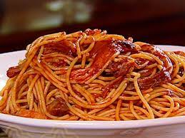

# BBQ Spaghetti

||| :timer_clock: Prep Time
 15 min
||| :timer_clock: Total Time
1 h 45 min
||| :knife_fork_plate: Serves
4
||| :cook: Difficulty Level
medium
|||

## Ingrediants
- 1 tablespoon olive oil
- 1 small green bell pepper, chopped
- 1/2 yellow onion, finely chopped
- 1 tablespoon garlic salt
- 3 1/2 cups Neely's BBQ sauce, recipe follows
- 1 pound pork, beef, or chicken, cooked and chopped into bite-size pieces
- 1 pound spaghetti
### Neely’s BBQ Sauce
- 2 cups ketchup
- 1 cup water
- 1/2 cup apple cider vinegar
- 5 tablespoons light brown sugar
- 5 tablespoons sugar
- 1/2 tablespoon fresh ground black pepper
- 1/2 tablespoon onion powder
- 1/2 tablespoon ground mustard
- 1 tablespoon lemon juice
- 1 tablespoon Worcestershire sauce

## Steps
1. In a large skillet, heat olive oil over medium heat. Saute the pepper and onion until softened, 1 to 2 minutes. Stir in the garlic salt. Add the BBQ sauce and bring to a boil. Reduce the heat to a low simmer and add the chopped meat. 

2.  Meanwhile, fill a large pot with water and bring to boil. Season liberally with salt and add spaghetti. Cook until al dente (firm but not hard), about 7 minutes, and drain. Toss spaghetti with sauce. 

### Neely’s BBQ Sauce 
(Yields: 3 1/2 cups)
1. In a medium saucepan, combine all ingredients. Bring mixture to a boil, reduce heat to simmer.Cooked uncovered, stirring frequently, for 1 hour 15 minutes.

[!ref target="blank" text="Neely’s Recipe"]([https://www.tastesoflizzyt.com/spiced-cranberry-apple-cider/](https://www.foodnetwork.com/recipes/bbq-spaghetti-recipe-1937436))

<!--- Different Styles of Resources for the bottom of the page

## Resources 
[!ref target="blank" text="Recipe"](https://www.tastesoflizzyt.com/spiced-cranberry-apple-cider/)
[!ref target="blank" text="Archive"](https://archive.is/xONP1)

## Picture of recipe card stored on GitHub

==- Recipe (front)

==- Recipe (back)

-->
