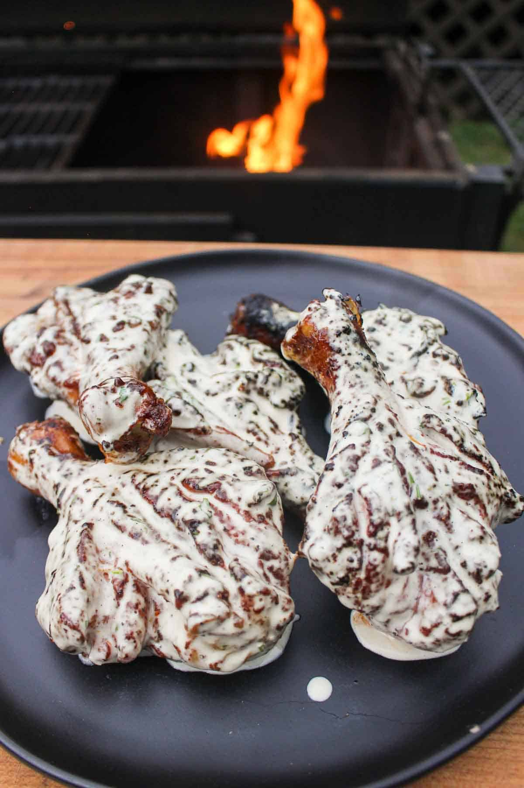

# Butterflied Chicken Drumsticks with Jalapeño Lime White Sauce

||| :timer_clock: Prep Time
15 min
||| :timer_clock: Total Time
6-8 min
||| :knife_fork_plate: Serves

||| :cook: Difficulty Level
easy bbq skills
|||

## Ingredients

### Chicken:

- 2-3 lbs Chicken Drumsticks
- 2 tbsp Canola Oil

### Chipotle BBQ Seasoning:

- 2 tbsp Brown Sugar
- 1.5 tbsp Chipotle Powder
- 1.5 tbsp Kosher Salt
- 1 tbsp Garlic Powder
- 1 tbsp Smoked Paprika
- 2 tsp Black Pepper
- 1.5 tsp Onion Powder
- 1.5 tsp Chile Powder
- 1 tsp Cinnamon
- ½ tsp Cayenne

### Jalapeño Lime White Sauce:

- 2 cups Mayonnaise
- 3/4 cup Apple Cider Vinegar
- ¼ cup Dijon Mustard
- ⅛ cup Brown Sugar
- ⅛ cup Diced Pickled Jalapeños with juice
- 2 tbsp Chopped Cilantro
- 1.5 tbsp Prepared Horseradish
- 2-3 medium Limes juiced

## Instructions
1.  Begin prepping your chicken drumsticks. Using a really sharp knife, slice one area on the drumstick from top to bottom all the way down to the bone. Pull apart the two sides of the slice and begin separating the meat from the bone so that the chicken drumstick is flayed open and flat. Make sure to leave some part of the meat, on the opposite side of the first cut, still connected. Repeat this for all of your drumsticks.

2. In a bowl, mix all the ingredients for the Chipotle BBQ seasoning. Lather your chicken with oil then generously season them. Mix together thoroughly, cover and place in the fridge to marinate for at least 1 hour.

3. Preheat a medium high heat fire (around 375F) for two zone cooking.

4. Mix all the ingredients for your Jalapeno Lime White Sauce and set to the side
5. Once the fire is ready, place your drumsticks over the direct heat and cook them for 2-3 minutes per side until they have been charred well. Once they have developed a good crust, pull them over the cooler side of the grill and cook until they reach 170F internal (about 10-15 minutes). Once done, pull them off and let them rest for 1-2 minutes
6. Right before serving, dip each drumstick right into the Jalapeño Lime White Sauce and enjoy!

[!ref target="blank" text="Recipe"](https://overthefirecooking.com/butterflied-chicken-drumsticks-with-jalapeno-lime-white-sauce/?fbclid=IwAR07BogC041VeYDloWNhjwFGOXsCpHSMBjyMNbK_TUHwA5G0Hc_DvpcoGrI_aem_AV6JKDgOoRC9qgLzYGntDzwuvtoVzwhVODcOCxpTyvlW0TAnw5AXvOy7Xf-DhUrqkwE&mibextid=9R9pXO)

<!--- Different Styles of Resources for the bottom of the page

## Resources 
[!ref target="blank" text="Recipe"](https://www.tastesoflizzyt.com/spiced-cranberry-apple-cider/)
[!ref target="blank" text="Archive"](https://archive.is/xONP1)

## Picture of recipe card stored on GitHub

==- Recipe (front)

==- Recipe (back)

-->
