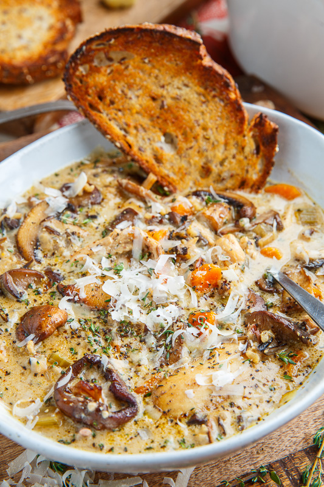

# Creamy Mushroom Chicken and Wild Rice Soup

||| :timer_clock: Prep Time
 10 min
||| :timer_clock: Total Time
50 min
||| :knife_fork_plate: Serves
6
||| :cook: Difficulty Level
medium
|||

## Ingredients

- 2 tablespoons butter
- 1 pound mushrooms, sliced
- 1 tablespoon butter
- 1 onion, diced
- 2 carrots, diced
- 2 stalks celery, diced
- 2 cloves garlic, chopped
- 1 teaspoon thyme, chopped
- 6 cups chicken broth
- 1 cup wild rice (or a blend of rice including wild rice)
- 1 1/2 cups chicken, cooked and diced or shredded
- 1 cup milk or cream
- 1 cup parmigiano reggiano (parmesan), grated
- salt and pepper to taste

## Instructions

1. Melt the butter in a pan over medium-high heat, add the mushrooms and cook until the mushrooms have released their liquids and the liquid has evaporated, about 10-15 minutes, before setting aside.
2. Melt the butter in the pan, add the onions, carrots and celery and cook until tender, about 8-10 minutes.
3. Mix in the garlic and thyme and cook until fragrant, about a minute.
4. Add the broth, rice, chicken and mushrooms, bring to a boil, reduce the heat and simmer, covered, until the rice is tender, about 20-30 minutes.
5. Mix in the milk and cheese and cook until the cheese has melted, before seasoning with salt and pepper to taste

### Note:
 The cooking time may vary depending on the kind of rice that you use. if the package that says to cook the rice for more or less time, go with that time.
### Option  1:
 Soak 1 ounce of dried mushrooms in 1 cup of just boiled water for 20 minutes before chopping the mushrooms and adding along with the garlic and adding the mushroom water along with the broth for an even more intense mushroom flavour!
### Option 2:
Add 2 tablespoons white miso paste in step 5 before seasoning with salt and pepper. 

## Resources 
[!ref target="blank" text="Recipe"]( https://www.closetcooking.com/creamy-mushroom-chicken-and-wild-rice/   )

