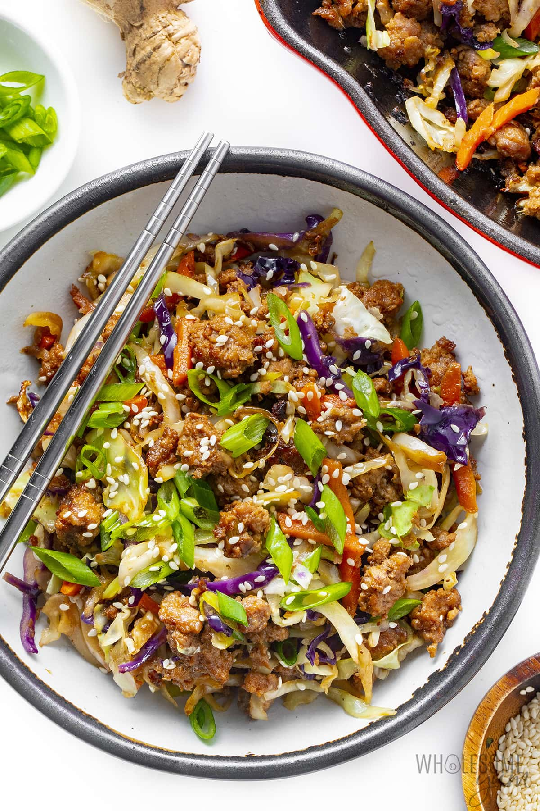

# Eggroll in a Bowl

||| :timer_clock: Prep Time
 
||| :timer_clock: Total Time
15 min
||| :knife_fork_plate: Serves
4
||| :cook: Difficulty Level
easy
|||

## Ingredients

- 1 tbsp Avocado oil 
- 4 cloves Garlic (minced) 
- 3 tbsp Fresh ginger (minced or grated; or use 3/4 tsp ground ginger) 
- 1 lb Ground pork (or ground beef) 
- 1 tsp Sea salt 
- 1/4 tsp Black pepper (or more if you want it spicy) 
- 6 cups Shredded coleslaw mix 
- 1/4 cup Coconut aminos 
- 2 tsp Toasted sesame oil 
- 1/4 cup Green onions 
- Sesame seeds (optional, for garnish) 

## Instructions

 1. Heat avocado oil in a large cast iron skillet over medium-high heat. Add garlic and ginger. Saute for about a minute, until fragrant.

 2. Add the ground pork (or beef). Season with sea salt and black pepper, and use a spatula to break up the meat. Increase heat to medium-high and cook until browned, about 7-10 minutes. (Most of the excess oil cooks away at this temperature, but you can drain it if you like.)

 3. Reduce heat to medium. Add the coleslaw mix and coconut aminos. Stir to coat. Cook for about 5 minutes, stirring occasionally, until the cabbage is tender.

 4. Remove from heat. Stir in the toasted sesame oil and green onions.

[!ref target="blank" text="Recipe"](https://www.wholesomeyum.com/egg-roll-in-a-bowl/)

<!--- Different Styles of Resources for the bottom of the page

## Resources 
[!ref target="blank" text="Recipe"](https://www.tastesoflizzyt.com/spiced-cranberry-apple-cider/)
[!ref target="blank" text="Archive"](https://archive.is/xONP1)

## Picture of recipe card stored on GitHub

==- Recipe (front)

==- Recipe (back)

-->
