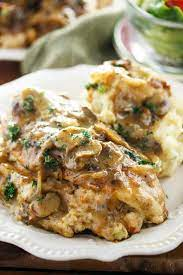

# Olive Garden Stuffed Chicken Marsala

||| :timer_clock: Prep Time
 
||| :timer_clock: Total Time
1hr 30min
||| :knife_fork_plate: Serves

||| :cook: Difficulty Level

|||

## Ingredients
### Cheese Stuffing
- 1⁄2 cup smoked provolone cheese
- 1 (8 ounce) shredded mozzarella cheese
- 1⁄4 cup parmesan cheese, grated
- 1⁄2 cup breadcrumbs 1 teaspoon fresh garlic, minced 
- 1⁄4 teaspoon crushed red pepper flakes 
- 2 tablespoons sun-dried tomatoes, flakes if in oil drain first 
- 1⁄3 cup sour cream 
- 1⁄2 teaspoon salt and pepper 
### Chicken
- 2 lbs boneless skinless chicken breasts 
- 4 ounces cooking oil 
- 2 cups flour salt and pepper, to taste
### Sauce
- 1 small onion, chopped 
- 6 cups button mushrooms, thinly sliced 
- 24 ounces marsala wine or 24 ounces beef broth 
- 8 ounces heavy cream 

## Instructions

1. Preheat oven to 350°F.
2. Stuffing:Combine all cheese stuffing ingredients in a bowl.
3. Chicken:Butterfly thickest section to create two lobes.Place pounded chicken breasts on a plate and place desired amount of stuffing on one half of chicken breast.
4. Gently press stuffing down and fold over other side of chicken breast. Preheat a large sauté pan on stove top. Add 4 oz. oil; heat oil until shimmering.
5. Place approximately 2 cups flour in a pan and season it to taste with salt and pepper. Dredge chicken in flour and shake off excess flour. Place stuffed chicken breasts in sauté pan with the preheated oil.
6. Cook each side until golden. When chicken is seared on both sides remove them from sauté pan and place them in a baking pan and into the oven for 10-20 minutes.
7. Bake until juices run clear and stuffing and center reach a temperature of at least 165°.

### Sauce:
Add the onions to the sauté pan. Stir with spatula. After 2 minutes add the mushrooms; sauté mixture until onions are translucent. Deglaze sauté pan with the marsala wine (make sure to incorporate particles from bottom of pan). Bring wine to a simmer and add heavy cream. Simmer sauce on low heat until reduced by half.

Place cooked chicken breast on a plate and top with onions, mushrooms and sauce.

<!--- Different Styles of Resources for the bottom of the page

## Resources 
[!ref target="blank" text="Recipe"](https://www.tastesoflizzyt.com/spiced-cranberry-apple-cider/)
[!ref target="blank" text="Archive"](https://archive.is/xONP1)

## Picture of recipe card stored on GitHub

==- Recipe (front)

==- Recipe (back)

-->
