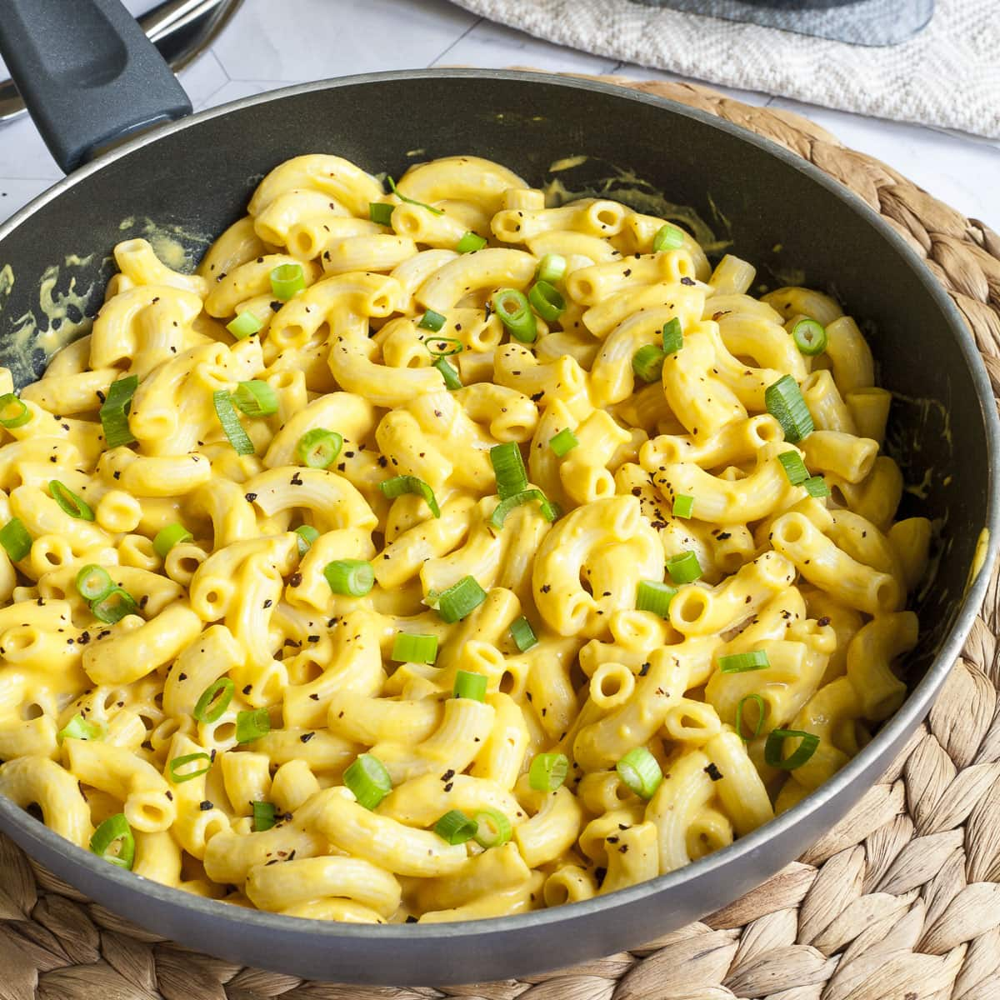

# Sunflower mac 'n' Cheeze

||| :timer_clock: Prep Time
 
||| :timer_clock: Total Time

||| :knife_fork_plate: Serves

||| :cook: Difficulty Level

|||

## Ingredients

+++ 1x

- 1 table spoon olive oil
- 1/4 cup chopped white onion
- 1/2 cup peeled and roughly chopped carrots
- 1 Yukon Gold potato, peeled and roughly chopped
- 1 garlic clove, minced
- 1/2 teaspoon salt
- 1 1/2 cups vegetable broth
- 1/2 cup raw, shelled sunflower seeds
- 8 ounces elbow noodles
- 2 teaspoons cornstarch
- 1 tablespoon lemon juice
- 1/2 teaspoon ground turmeric
- 1/4 teaspoon smoked paprika
- 2 tablespoons nutritional yeast
- 4 teaspoons tomato paste

+++ 2x

- 2 tablespoon olive oil
- 1/2 cup chopped white onion
- 1 cup peeled and roughly chopped carrots
- 2 Yukon Gold potato, peeled and roughly chopped
- 2 garlic clove, minced
- 1 teaspoon salt
- 3 cups vegetable broth
- 1 cup raw, shelled sunflower seeds
- 16 ounces elbow noodles
- 4 teaspoons cornstarch
- 2 tablespoon lemon juice
- 1 teaspoon ground turmeric
- 1/2 teaspoon smoked paprika
- 4 tablespoons nutritional yeast
- 8 teaspoons tomato paste

+++ 3x

- 3 tablespoon olive oil
- 3/4 cup chopped white onion
- 1 1/2 cup peeled and roughly chopped carrots
- 3 Yukon Gold potato, peeled and roughly chopped
- 3 garlic clove, minced
- 1 1/2 teaspoon salt
- 4 1/2 cups vegetable broth
- 1 1/2 cup raw, shelled sunflower seeds
- 24 ounces elbow noodles
- 6 teaspoons cornstarch
- 3 tablespoon lemon juice
- 1 1/2 teaspoon ground turmeric
- 3/4 teaspoon smoked paprika
- 6 tablespoons nutritional yeast
- 12 teaspoons tomato paste

+++

## Instructions
1. In a large pot, heat the olive oil over medium heat. Add the onion, carrots, and potato and cook, stirring often, for 5 minutes, or until the vegetables have softened slightly.
2. Add garlic, salt, vegetable broth, and sunflower seeds and bring to a boil. Reduce the heat to low and simmer for 10 minutes, or until the potatoes are soft.
3. While the vegetables are simmering, bring 6 cups of water to a boil in a large pot. Add the elbow noodles and cook until al dente. Drain and set aside.
4. Transfer the vegetable mixture to a blender with the cornstarch, lemon juice, turmeric, paprika, nutritional yeast, and tomato paste. Puree until very creamy and smooth, scraping down the sides as neede.d
5. Return the puree to the pot and simmer over low heat until just thickened. Taste and add more salt, pepper, and/or lemon juice as needed. Add the cooked pasta and stir to combine. Serve!

