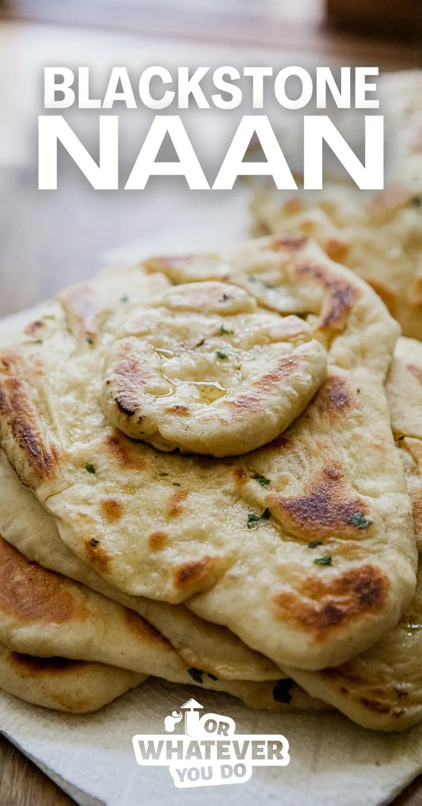

# Blackstone Naan

||| :timer_clock: Prep Time
 
||| :timer_clock: Total Time

||| :knife_fork_plate: Serves

||| :cook: Difficulty Level

|||

## Ingredients

- 2 cups warm water
- 3 tablespoons + 2 teaspoons yeast
- 2 tablespoons sugar
- 1/3 cup olive oil
- 1 cup sour cream
- 4 eggs
- 1 tablespoon salt
- 10-12 cups all-purpose flour
- 1/2 cup butter, melted
- 1 tablespoon crushed garlic
- 2 teaspoons parsley

## Instructions
1. Combine the warm water, yeast, sugar, olive oil, sour cream, eggs, and salt in a bowl. Whisk to combine.
2. Add in 6 cups of the flour and stir briskly with a wooden spoon until all of the flour is absorbed into the mixture.
3. Continue adding flour, 1 cup at a time, until a soft dough forms.
4. Turn the ball of dough out onto a well-floured surface and knead for 5-6 minutes, continuing to add small amounts of flour as necessary to prevent the dough from sticking to your hands and the counter.
5. Put the kneaded dough ball into a lightly greased bowl and covered with a lightly greased piece of plastic wrap. Let rise for about an hour, or until doubled in size.
6. Dump the risen dough ball out onto a floured counter and cut into 24 equally-sized dough balls.
7. Melt the butter and mix in the garlic and parsley.
8. Preheat your griddle over medium-high heat.
9. Roll each dough ball out with a rolling pin until it is about 4-6" in diameter. You'll want to work in batches of 6-12. If you roll them ALL out and stack them all, the bottom WILL stick together before they are done cooking. Ask me how I know.
10. Keep in mind, the thicker you leave the dough the more it'll puff up.
11. Cook the dough in batches of 6 on your lightly oiled griddle. Flip after the first side gets browned and there are bubbles formed on the top. Flip, and cook until the other side is getting browned on the parts that are touching the griddle surface.
12. Flip again, brush with garlic butter, and remove from the griddle.
 ## Enjoy warm!

<!--- Different Styles of Resources for the bottom of the page

## Resources 
[!ref target="blank" text="Recipe"](https://www.tastesoflizzyt.com/spiced-cranberry-apple-cider/)
[!ref target="blank" text="Archive"](https://archive.is/xONP1)

## Picture of recipe card stored on GitHub

==- Recipe (front)

==- Recipe (back)

-->
