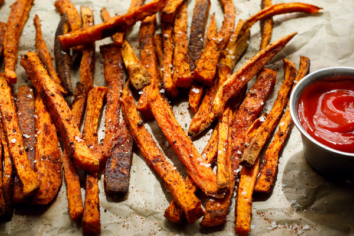

# Balsamic-Glazed Seasoned Yam Fries

||| :timer_clock: Prep Time
 
||| :timer_clock: Total Time

||| :knife_fork_plate: Serves
4
||| :cook: Difficulty Level

|||

## Ingredients

+++ 1x

- 3 lb orange sweet potatoes
- 1 teaspoon garlic powder
- 1/2 teaspoon Dijon mustard
- 1/2 teaspoon smoked paprika
- 1 1/2 tablespoons balsamic vineger
- 1 1/2 tablespoons pure maple syrup or agave nectar
- 1 teaspoon chipotle hot sauce
- 1/2 scant teaspoon sea salt

+++ 2x

- 6 lb orange sweet potatoes
- 2 teaspoon garlic powder
- 1 teaspoon Dijon mustard
- 1 teaspoon smoked paprika
- 3 tablespoons balsamic vineger
- 3 tablespoons pure maple syrup or agave nectar
- 2 teaspoon chipotle hot sauce
- 1 scant teaspoon sea salt

+++ 3x

- 9 lb orange sweet potatoes
- 3 teaspoon garlic powder
- 1 1/2 teaspoon Dijon mustard
- 1 1/2 teaspoon smoked paprika
- 4 1/2 tablespoons balsamic vineger
- 4 1/2 tablespoons pure maple syrup or agave nectar
- 3 teaspoon chipotle hot sauce
- 1 1/2 scant teaspoon sea salt

+++

## Instructions
1. Preheat oven to 400 degrees. Line a large, rimmed bking sheet with parchment paper and wipe over the surface of the parchment with just a touch of oil.
2. Wash and peel the sweet potatoes. Cut the potatoes into wedges. This is the easiest by cutting in half and then, depending on the size, cutting 3-4 wedges from each half.
3. In a large bowl, whisk together the garlic powder, Dijon mustard, smoked paprika, balsamic vinegar, maple syrup, and hot sauce. Add the wedges to the mixture and toss to coat. Spread on the prepared baking sheet, and pour over any remaining liquid. Sprinkle on the sea salt.
4. Bake for 50-65 minutes, or until the sweet potatoes have softened and caramelized in spots, rotating/flipping the wedges once or twice through baking. Taste, and season with extra sea salt if desired. Serve!

<!--- Different Styles of Resources for the bottom of the page

## Resources 
[!ref target="blank" text="Recipe"](https://www.tastesoflizzyt.com/spiced-cranberry-apple-cider/)
[!ref target="blank" text="Archive"](https://archive.is/xONP1)

## Picture of recipe card stored on GitHub

==- Recipe (front)

==- Recipe (back)

-->
