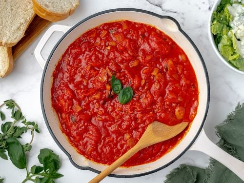

# Thick 'N Hearty Tomato Sauce

||| :timer_clock: Prep Time
 
||| :timer_clock: Total Time

||| :knife_fork_plate: Serves
7-8 cups
||| :cook: Difficulty Level

|||

## Ingredients

+++ 1x

- 2 tablespoons plus 2 1/2 - 3 cups water, divided
- 4 medium-large cloves garlic, chopped
- 1 1/4 teaspoons sea salt
- Freshly ground black pepper to taste (optional)
- 1/4 cup white wine (optional; *see note*)
- 2 cups dried lentils, rinsed
- 1 can (28 oz) or box (26 oz) crushed tomatoes (*see note*)
- 1 cup finely grated or minced carrot (*see note*)
- 1/4 cup tomato paste or 1/2 cup sun-dried tomatoes
- 2 teaspoons dried basil
- 1 teaspoon dried oregano
- 1/2 teaspoon fennel seed (*see note*)
- 1 tablespoon balsamic vinegar
- 1 1/2 - 2 teaspoons pure maple syrup

+++ 2x

- 4 tablespoons plus 5 - 6 cups water, divided
- 8 medium-large cloves garlic, chopped
- 2 1/2 teaspoons sea salt
- Freshly ground black pepper to taste (optional)
- 1/2 cup white wine (optional; *see note*)
- 4 cups dried lentils, rinsed
- 2 can (56 oz) or box (52 oz) crushed tomatoes (*see note*)
- 2 cup finely grated or minced carrot (*see note*)
- 1/2 cup tomato paste or 1/2 cup sun-dried tomatoes
- 4 teaspoons dried basil
- 2 teaspoon dried oregano
- 1 teaspoon fennel seed (*see note*)
- 2 tablespoon balsamic vinegar
- 3 - 4 teaspoons pure maple syrup

+++ 3x

- 6 tablespoons plus 7 1/2 - 9 cups water, divided
- 12 medium-large cloves garlic, chopped
- 3 3/4 teaspoons sea salt
- Freshly ground black pepper to taste (optional)
- 3/4 cup white wine (optional; *see note*)
- 6 cups dried lentils, rinsed
- 3 can (84 oz) or box (78 oz) crushed tomatoes (*see note*)
- 3 cup finely grated or minced carrot (*see note*)
- 3/4 cup tomato paste or 1/2 cup sun-dried tomatoes
- 6 teaspoons dried basil
- 3 teaspoon dried oregano
- 1 1/2 teaspoon fennel seed (*see note*)
- 3 tablespoon balsamic vinegar
- 4 1/2 - 6 teaspoons pure maple syrup

+++

**Wine Note**: The alcohol burns off through simmering and leaves a lovely flavor, but you can omit if you prefer

**Tomatoes Note**: use an immersion blender to "crush" whole or diced canned tomatoes. pour off some liquid into your soup pot, then insert an immersion blender into th ecan and pulse to desired texture.

**Carrot Note**: Measure roughtly a heaping cup of sliced chopped carrots to yeild 1 cup minced. You can grate the carrot, or pop it in a mini food processor and pulse until minced.

**Fennel Note**: I quite like the flavor fennel seed adds to this sauce. If you think your kiddos might be fussy, use 1/4 teaspoon.

**Kitchen Tip**: Kitchen Tip: This makes a large batch, great for a large dinner party, or to freeze portions.

## Instructions
1. Add tablespoons water, garlic, sea salt, and black pepper to a large pot.
2. Turn heat to medium-low, and cook for 4-5 minutes. Don't let the garlic burn (reduce heat if needed).
3. Add the wine, bing head to a boail, and let bubble for a minute or two.
4. add lentils, tomatoes, carrot, tomato paste, basil, oregano, fennel seed, remaining cups water, vinegar, and maple syrup.
5. Increase heat to high to bring mixture to a boil. Then reduce heat to medium-low, cover, and cook for 25 minutes, stirring occasionally.
6. If, after 25 minutes, the lentils aren't softened, add more water and simmer again until cooked through.
7. Taste, season as desired, and thin with water if needed. if you like, use an immersion blender to puree and smooth out the sauce. 
8. Serve over pasta, quinoa, rice, or layer in lasagna.

<!--- Different Styles of Resources for the bottom of the page

## Resources 
[!ref target="blank" text="Recipe"](https://www.tastesoflizzyt.com/spiced-cranberry-apple-cider/)
[!ref target="blank" text="Archive"](https://archive.is/xONP1)

## Picture of recipe card stored on GitHub

==- Recipe (front)

==- Recipe (back)

-->
